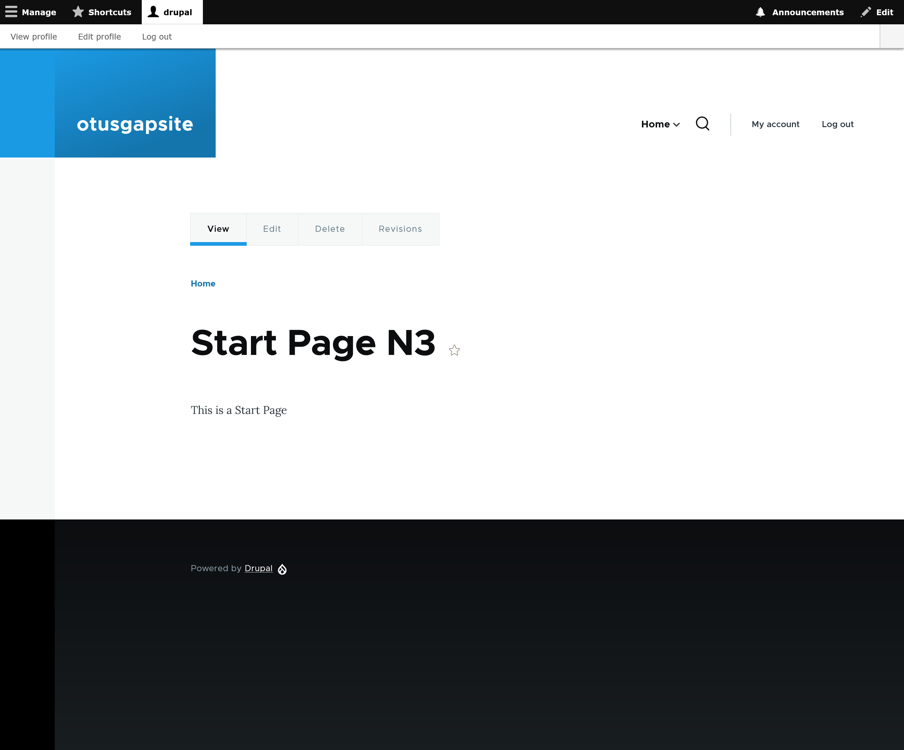
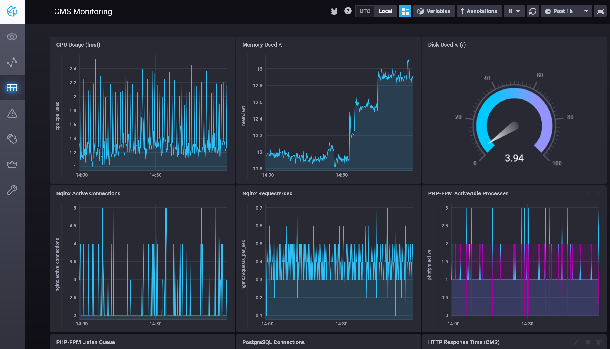
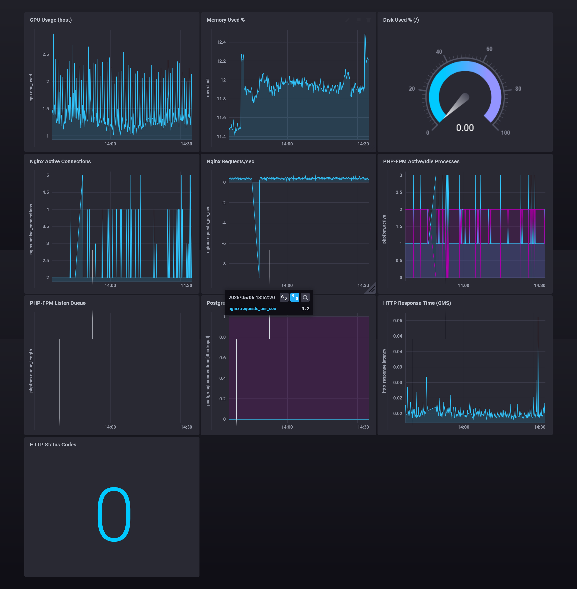
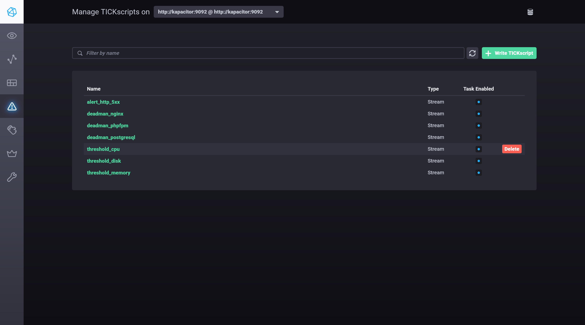
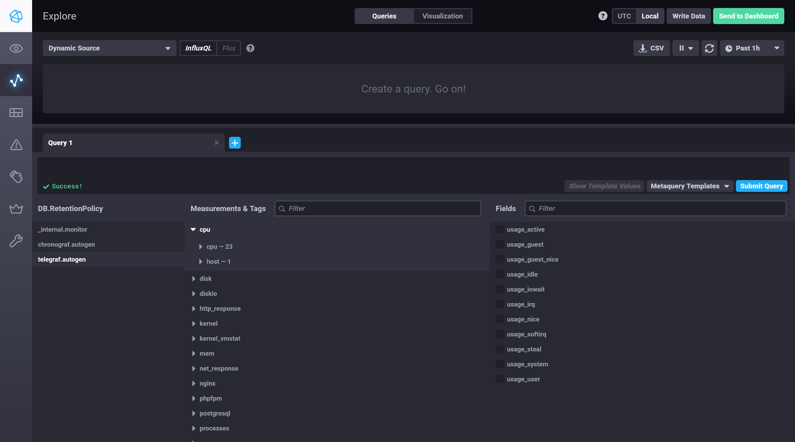

# ДЗ: Установка и настройка TICK стека

## Цель

Установить и настроить Telegraf, InfluxDB, Chronograf, Kapacitor для мониторинга CMS (Drupal + nginx + PHP-FPM + PostgreSQL).

---

## Архитектура

CMS (Drupal):
- nginx 1.25 (веб-сервер)
- PHP 8.3-FPM (обработка запросов)
- PostgreSQL 16 (база данных)

TICK-стек:
- Telegraf 1.30 (сбор метрик)
- InfluxDB 1.8 (хранение метрик)
- Chronograf 1.10 (визуализация и UI)
- Kapacitor 1.6 (алертинг)

Все компоненты запущены в Docker Compose.
Мониторинговый стек подключён к CMS через общую сеть `cms-shared-net`.

---

## Запуск

### 1. Запустить CMS

    docker compose -f compose.core.yml up -d

Проверка: http://localhost:8080

### 2. Запустить TICK-стек

    docker compose -f compose.tick.yml up -d

Проверка:
- Chronograf: http://localhost:8888
- InfluxDB: http://localhost:8086/ping (ответ 204)
- Kapacitor: http://localhost:9092/kapacitor/v1/ping

---

## Конфигурация

### Telegraf (TICK-1/telegraf/telegraf.conf)

Собирает метрики:

| Плагин | Что собирает | Endpoint |
|--------|-------------|---------|
| inputs.cpu | CPU usage по ядрам | /proc/stat |
| inputs.mem | Использование памяти | /proc/meminfo |
| inputs.disk | Использование дисков | /proc/mounts |
| inputs.system | Load average, uptime | /proc/loadavg |
| inputs.nginx | Active connections, requests | http://nginx/nginx_status |
| inputs.phpfpm | Active/idle processes, queue | http://nginx/fpm-status |
| inputs.postgresql | Connections, transactions, deadlocks | host=db port=5432 |
| inputs.http_response | HTTP availability, response time | http://nginx/ |
| inputs.net_response | TCP availability | nginx:80, db:5432 |
| inputs.docker | Container metrics | unix:///var/run/docker.sock |

### InfluxDB (TICK-1/influxdb/influxdb.conf)

Конфиг содержит базовые параметры хранения и HTTP:
- HTTP API на порту 8086 (bind-address)
- HTTP auth отключён (auth-enabled)
- Директории данных: /var/lib/influxdb/data, /wal, /meta

База данных `telegraf` создаётся автоматически через
переменную окружения INFLUXDB_DB в compose.tick.yml.

Retention policy `autogen` создаётся InfluxDB по умолчанию
с бесконечным хранением.

### Chronograf (TICK-1/chronograf/chronograf.env)

Chronograf не использует традиционный конфигурационный файл.
Настраивается через переменные окружения в compose.tick.yml:

- INFLUXDB_URL: адрес InfluxDB для подключения источника данных
- KAPACITOR_URL: адрес Kapacitor для управления алертами
- RESOURCES_PATH: путь к предзагруженным ресурсам (дашборды, sources)

Состояние (дашборды, алерты, пользователи) хранится в
/var/lib/chronograf/chronograf-v1.db (BoltDB).

### Nginx — метрики (nginx/conf.d/drupal.conf)

Добавлены endpoints для сбора метрик:

    location = /nginx_status {
        stub_status;
        access_log off;
        allow 127.0.0.1;
        allow 172.16.0.0/12;
        deny all;
    }

    location = /fpm-status {
        access_log off;
        include fastcgi_params;
        fastcgi_param SCRIPT_FILENAME $document_root$fastcgi_script_name;
        fastcgi_pass cms-php:9000;
    }

### PHP-FPM (php/conf.d/www.conf)

    [www]
    pm.status_path = /fpm-status
    ping.path = /ping

### PostgreSQL — пользователь мониторинга

    CREATE USER telegraf WITH PASSWORD 'telegraf_pass';
    GRANT pg_read_all_stats TO telegraf;

### Kapacitor (TICK-1/kapacitor/kapacitor.conf)

Настроен для подключения к InfluxDB и загрузки задач из директории /etc/kapacitor/load.

---

## Сводный Dashboard CMS

Dashboard "CMS Monitoring" в Chronograf содержит:

| Панель | Measurement | Поля |
|--------|-------------|------|
| CPU Usage (host) | cpu | usage_system + usage_user (cpu-total) |
| Memory Used % | mem | used_percent |
| Disk Used % (/) | disk | used_percent (path=/) |
| Nginx Active Connections | nginx | active |
| Nginx Requests/sec | nginx | derivative(requests, 1s) |
| PHP-FPM Active/Idle Processes | phpfpm | active_processes, idle_processes |
| PHP-FPM Listen Queue | phpfpm | listen_queue |
| PostgreSQL Connections | postgresql | numbackends (GROUP BY db) |
| HTTP Response Time (CMS) | http_response | response_time |
| HTTP Status Codes | http_response | http_response_code |

---

## Алерты Kapacitor

### Deadman — падение компонентов CMS

| Имя | Measurement | Условие |
|-----|-------------|---------|
| deadman_nginx | nginx | Нет данных > 1 минуты |
| deadman_phpfpm | phpfpm | Нет данных > 1 минуты |
| deadman_postgresql | postgresql | Нет данных > 1 минуты |

### Threshold — перерасход ресурсов

| Имя | Measurement | Условие |
|-----|-------------|---------|
| threshold_cpu | cpu | 100 - usage_idle > 85% (CRITICAL) |
| threshold_memory | mem | used_percent > 90% (CRITICAL) |
| threshold_disk | disk | used_percent > 85% (CRITICAL) |

### HTTP 5xx ошибки

| Имя | Measurement | Условие |
|-----|-------------|---------|
| alert_http_5xx | http_response | http_response_code >= 500 (WARNING) |

Список задач Kapacitor:

    docker exec tick-kapacitor kapacitor list tasks

---

## Структура директории TICK-1

    TICK-1/
    ├── telegraf/
    │   └── telegraf.conf
    ├── influxdb/
    │   └── influxdb.conf
    ├── chronograf/
    │   └── chronograf.env
    └── kapacitor/
        └── kapacitor.conf

---

## Скриншоты

### CMS (Drupal)

### Dashboard CMS в Chronograf

### Kapacitor — список алертов

### Chronograf — Measurements

---

## Проверка работоспособности

    # Все контейнеры запущены
    docker ps --format "table {{.Names}}\t{{.Status}}\t{{.Networks}}"

    # Telegraf собирает метрики nginx
    docker exec tick-telegraf telegraf --config /etc/telegraf/telegraf.conf \
      --test --input-filter nginx 2>&1 | grep "^>"

    # Kapacitor — список активных задач
    docker exec tick-kapacitor kapacitor list tasks

    # InfluxDB — список измерений
    docker exec tick-influxdb influx -execute "SHOW MEASUREMENTS ON telegraf"

---

## Зависимости и версии

| Компонент | Версия |
|-----------|--------|
| Telegraf | 1.30 |
| InfluxDB | 1.8 |
| Chronograf | 1.10 |
| Kapacitor | 1.6 |
| nginx | 1.25-alpine |
| PHP-FPM | 8.3-alpine |
| PostgreSQL | 16 |